# Automated Lower-Limb Kinematic Analysis Pipeline for Physiotherapy Rehabilitation

A modular, computer-vision-based system for objective evaluation of lower-limb joint kinematics (hip, knee, ankle) during physiotherapy exercises. The pipeline combines deep-learning background segmentation, adaptive video quality correction, 2D skeletal pose estimation, and digital signal processing to extract clinically relevant motion features from monocular video.

---

## Pipeline Architecture

```mermaid
flowchart TD
    A[Video Input] --> B[Adaptive Quality Enhancement\ncontrast · brightness · noise · blur]
    B --> C[Background Segmentation\nIS-Net / MediaPipe fallback]
    C --> D[2D Pose Estimation\nMediaPipe PoseLandmarker]
    D --> E[Joint Angle Computation\n2D vector dot-product]
    E --> F[Temporal Smoothing\nSavitzky-Golay filter]
    F --> G[Kinematic Derivatives\nvelocity · acceleration]
    G --> H[Feature Extraction\nROM · repetitions · bilateral symmetry]
    H --> I[(CSV Time-series\n& Summary)]
    H --> J[(HTML Patient\nDashboard)]
```



---

## Design Rationale

### Adaptive Video Quality Enhancement
Clinical and home-recorded footage rarely meets ideal imaging conditions. The `VideoEnhancer` module (`modules/video_enhance.py`) applies **per-frame, condition-specific corrections** before pose estimation using only OpenCV and NumPy:

| Condition | Detection | Correction |
|:---|:---|:---|
| Low contrast | Michelson contrast < 0.35 | CLAHE on LAB L-channel |
| Overexposed / glare | Mean luminance > 200 or >5% clipped | Gamma compression |
| Underexposed / dark | Mean luminance < 50 | Gamma boost |
| Gaussian / sensor noise | Noise σ estimate | Fast Non-Local Means denoising |
| Salt-and-pepper noise | Isolated extreme pixel fraction | Median filter |
| Motion blur | Laplacian variance < threshold | Unsharp masking |
| Colour cast | Per-channel mean RMS deviation | Grey-world white balance |
| Low-light (dark + noisy) | Combined brightness + noise check | Denoise → CLAHE → gamma boost |

Corrections are applied in a fixed order (white balance → denoise → brightness → contrast → sharpening) to avoid compounding artefacts. All thresholds are tunable in `config.py`.

### Background Segmentation (IS-Net)
**IS-Net** (Highly Accurate Dichotomous Image Segmentation) isolates the patient foreground from potentially dynamic clinical backgrounds (equipment, other patients, lighting variation). The system automatically falls back to MediaPipe's built-in segmentation if IS-Net weights are unavailable.

### 2D Pose Estimation (MediaPipe)
**MediaPipe PoseLandmarker** detects 33 body landmarks from a single monocular camera feed. The pipeline extracts **2D pixel coordinates (x, y)** for each anatomical landmark; no depth information is used. The two-stage detector-tracker architecture enables reliable real-time inference on CPU-only consumer hardware, removing the need for multi-camera motion capture laboratory infrastructure.

### Computational Efficiency
A configurable **frame downsampling stride** balances throughput against temporal resolution:
- `--stride 2` (default): processes every other frame - suitable for CPU-only deployment.
- `--stride 1`: processes all frames - recommended for high-frequency movements, tremor analysis, or research-grade output.

---

## Processing Stages

| # | Stage | Method |
|:--|:---|:---|
| 1 | Adaptive quality enhancement | Per-condition OpenCV corrections |
| 2 | Foreground isolation | IS-Net deep segmentation |
| 3 | 2D landmark detection | MediaPipe PoseLandmarker (VIDEO mode) |
| 4 | Joint angle computation | 2D vector dot-product at each joint vertex |
| 5 | Temporal smoothing | Savitzky-Golay filter (preserves peak amplitude) |
| 6 | Kinematic derivatives | Central-difference finite differences (deg/s, deg/s²) |
| 7 | Repetition segmentation | Joint flexion peak detection |
| 8 | ROM & symmetry analysis | Min/max angle range; Pearson cross-correlation |

---

## Repository Structure

```
pipeline/
├── config.py               # Global constants, thresholds, and pipeline switches
├── main.py                 # Entry point; batch-processes videos in dataset/
├── verify_pipeline.py      # Output integrity smoke-test
├── requirements.txt
├── models/
│   └── isnet.py            # PyTorch IS-Net architecture
└── modules/
    ├── video_utils.py      # Frame reader and standardiser
    ├── video_enhance.py    # Adaptive per-frame quality enhancement
    ├── background_seg.py   # IS-Net / MediaPipe segmentation wrapper
    ├── pose_estimator.py   # MediaPipe 2D landmark extraction
    ├── kinematics.py       # 2D angle computation and derivatives
    ├── filter_utils.py     # Savitzky-Golay smoothing
    ├── feature_extractor.py # ROM, repetition, and symmetry features
    └── exporter.py         # CSV and HTML dashboard export
```

---

## Outputs

| File | Format | Contents |
|:---|:---|:---|
| `all_videos_timeseries.csv` | CSV | Frame-by-frame joint angles, velocities, accelerations, timestamps |
| `all_videos_summary.csv` | CSV | Per-video ROM, symmetry scores, rep counts |
| `master_dashboard.html` | HTML/JS | Self-contained interactive report with Chart.js signal plots |
| `<video>/plots/` | PNG | Static knee flexion angle and velocity charts |

---

## Installation & Usage

```bash
pip install -r requirements.txt
python main.py
```

Place `.mp4 / .avi / .mov` recordings (or `.zip` archives) in `dataset/` before running. A synthetic squat demo is generated automatically if no videos are found.

**IS-Net weights** (optional): download `isnet-general-use.pth` and place it at `models/weights/isnet-general-use.pth`. Without it the pipeline uses MediaPipe segmentation.

### CLI Reference

| Flag | Default | Description |
|:---|:---|:---|
| `--dataset DIR` | `dataset` | Input video directory |
| `--stride N` | `2` | Frame sampling stride |
| `--device cpu\|cuda` | `cpu` | IS-Net compute device |
| `--save-video` | off | Save annotated skeleton overlay video |
| `--enhance` / `--no-enhance` | on | Toggle video quality enhancement |
| `--enhance-level auto\|light\|aggressive` | `auto` | Enhancement aggressiveness |

```bash
# High-fidelity run with GPU and aggressive enhancement
python main.py --stride 1 --device cuda --enhance-level aggressive

# Disable enhancement for pre-processed footage
python main.py --no-enhance
```

---

## Viewing the Dashboard

Open `output/master_dashboard.html` directly in any modern browser, or serve it locally:

```bash
python -m http.server 8000 --directory output
# → http://localhost:8000/master_dashboard.html
```
